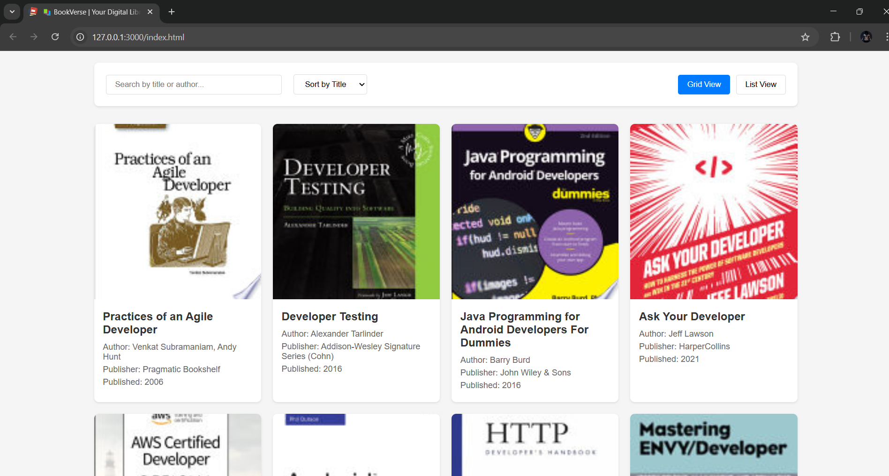
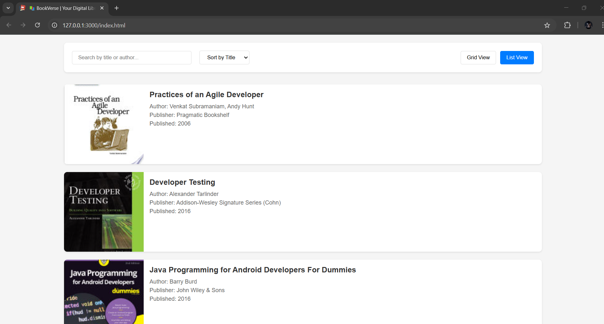
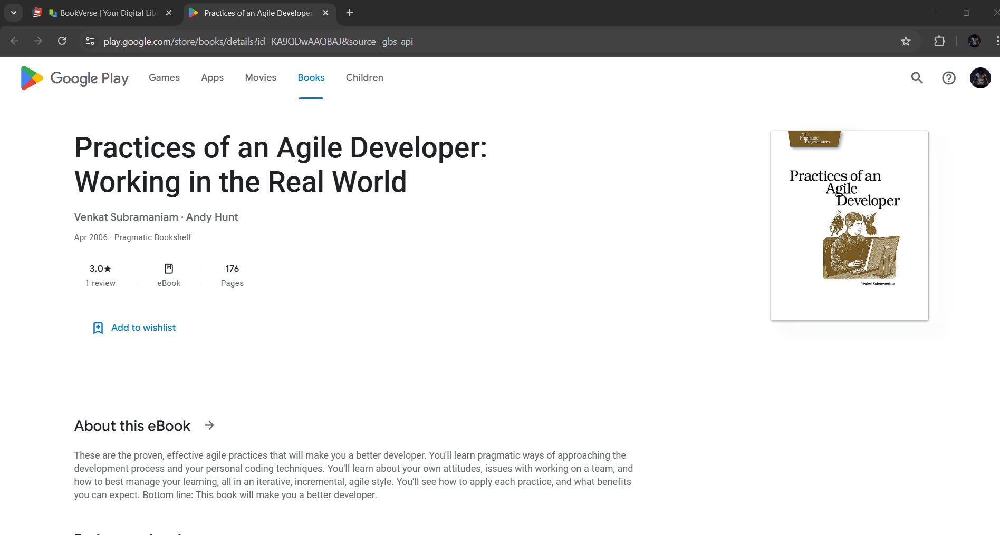

# Books Library

A dynamic Book Library website that fetches and displays book data from the **FreeAPI.app**. This project demonstrates working with API requests, handling JSON data, and rendering dynamic content using JavaScript.

## 🌟 Features
- 📖 Fetch and display books in **List/Grid** format
- 🔍 **Search** books by Title or Author
- 🔄 **Sort** books alphabetically or by published date
- 📜 **Pagination** for seamless browsing
- 🔗 Clicking a book opens more details in a **new tab**

## 🛠 Tech Stack
- **HTML** – Structure the web page
- **CSS** – Style the components
- **JavaScript** – Fetch API & Dynamic Rendering

## 📡 API Used
- Endpoint: [GET https://api.freeapi.app/api/v1/public/books](https://api.freeapi.app/api/v1/public/books)
- API Docs: [FreeAPI Documentation](https://freeapi.hashnode.space/api-guide/apireference/getBooks)

## 🚀 Getting Started
1. Open the `index.html` file in a browser.
2. Enjoy browsing books dynamically!

## 🎯 Project Preview
🚀 Live Demo: [https://books-library-mu-eight.vercel.app/]

## 📌 Screenshots

### 📖 Home Page

### 🔍 Search Feature

### 📚 Book Details

## 🤝 Contributing
Feel free to fork the repo and submit a pull request.

